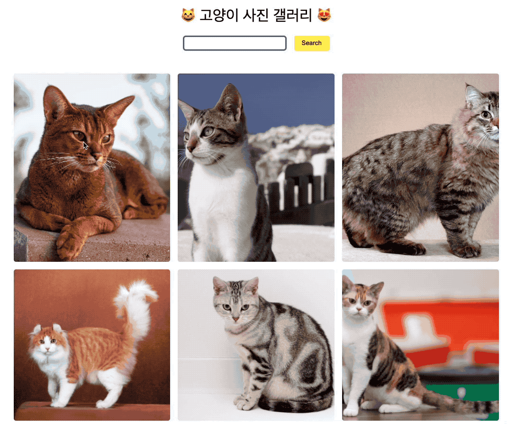

# CATURE

cat + picture = cature

thecatapi를 활용하여 고양이 사진을 불러오는 웹 애플리케이션 구현



# 실행 방법

```shell
// 프로젝트 클론, 디렉토리 이동
git clone https://github.com/aidencoders/cature
cd cature

// 프로젝트 실행에 필요한 dependencies 설치
npm install

// 프로젝트 실행 (https://localhost:3000)
npm start
```

# 기능

- 고양이 사진 불러오기 & 검색

# 배웠던 것들

## 타입스크립트 활용

타입스크립트를 처음 프로젝트에 적용해 보았습니다.

처음에는 styled-components theme 설정하는데에도 엄청난 에러를 만나 당황했었는데 많이 부족하지만 조금은 적응하는 시간이 되지 않았나 싶습니다.

라이브러리를 쓰면 그에 맞는 타입을 찾아서 입력하는게 힘들기도 했지만 한편으로는 퍼즐을 맞추는것 같아 재밌는 시간이었어요.

퍼즐이 잘 맞아서 편집기에서 자동완성을 해줄때 행복했습니다.

## Redux Thunk

이번에 Redux Thunk도 처음 사용해 보았습니다.

비동기 로직을 Redux에서 처리하려고 여러가지 라이브러리들을 찾아보았는데 (RTK Query, Redux Observable ) 우선 Thunk부터 동작원리를 조금 이해하고 다른 라이브러리를 쓰는게 맞을것 같아 Thunk를 사용하였습니다.

여러 시행착오를 겪었지만 새로운 것을 배우고 활용해 봤다는 기쁨이 더 큽니다 !

# 어렵거나 아쉬웠던 것들

## RxJS, NextJS

사실 처음에는 이것 저것 많이 시도해보려고 RxJS 개념도 익히고 NextJS에 대한 지식도 습득했었습니다.

새로운 패러다임에 관심이 많은 저에게 특히 RxJS는 흥미로운 관심사로 다가왔습니다.

이것들을 이해하고 반응형 프로그래밍을 할 수 있게 된다면 큰 희열이 있을것 같아 해당 프로젝트가 끝나더라도 지속적으로 공부할 계획입니다.

## 시간 관리

처음에 계획을 세우고 프로젝트를 접근했을 때 욕심이 너무 과했던 나머지 사전조사, 동작원리 등 개념 공부에 시간을 많이 뺏겼고 시간 관리에 실패하지 않았나 싶습니다.

다음에는 태스크를 조금 더 잘게 쪼개고 러프하게나마 시간을 정해놓은 뒤 그 시간을 넘지 않는 형태로 시간 관리를 해 볼 계획입니다.

## 테스트코드

정말 기본적인 테스트 코드밖에 작성하지 못해서 아쉽습니다.

시간 관리에 실패하기도 했고 현재 코드가 테스트를 작성하기에 알맞은 코드는 아닌것 같습니다.

기존에는 이벤트 핸들러들을 props로 내려서 FireEvent로 테스팅한다거나, redux 테스트의 경우에는 가상의 store를 만들어서 디스패치를 일으키는 형태로 테스트를 했었습니다.

현재는 비동기 요청만이 redux에 있어서 thunk 관련하여 테스트 코드를 더 작성해볼 계획입니다.

# 감사의 말씀

기능은 간단해 보였지만 요구사항에 기입해주신 부분 덕분에 새로운 기술들을 프로젝트에 적용해 볼 수 있는 기회를 얻은것 같습니다.

RxJS를 잠깐이나마 공부하면서 비동기 흐름을 구독해서 데이터를 정제하는 과정이 신세계로 다가왔습니다.

시각이 조금은 넓어진 느낌이랄까요?

이러한 기회를 주셔서 깊은 감사를 드립니다.
